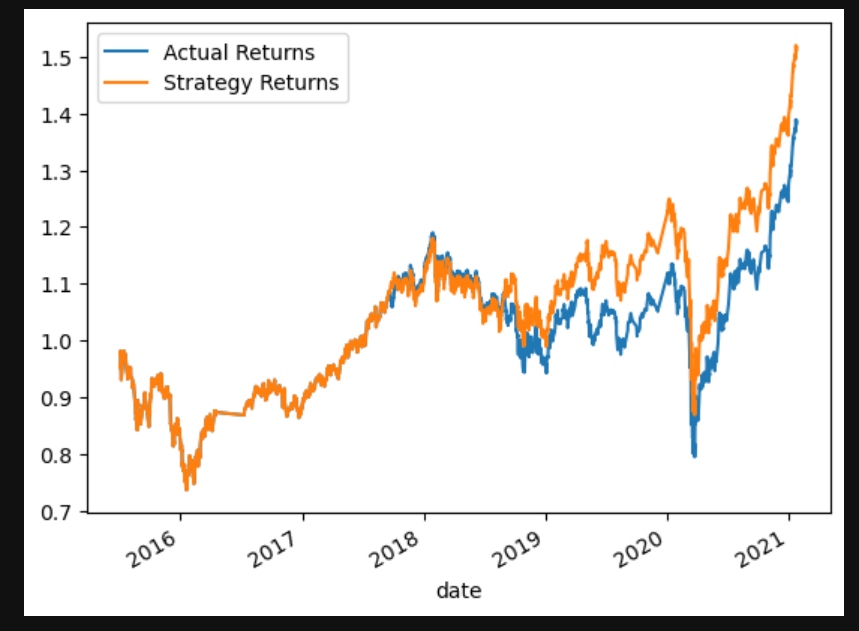

# Module 14 

## Overview

The purpose of the module is to employ a machine learning bot with different parameters and tuning, in order to find the best possible outcomes (i.e. strategies) to deploy. Multiple methods, values, and training periods are tested in order to provide a relatively strong oversight of the possilbe parameters. After creating and running the new bots, the goal is to provide an optimal strategy to partake to ensure the highest possible returns.

### Baseline Model

The baseline model in this evaluation is the basical svm classifier output.

### Alternate Training Window Model

### Altername SMA value Model

### Logistic Regression Model 

The logistic regression model is our way of bringing in an outisde method to our analysis to compare the results and to ensure we are using the most efficient model possible.
