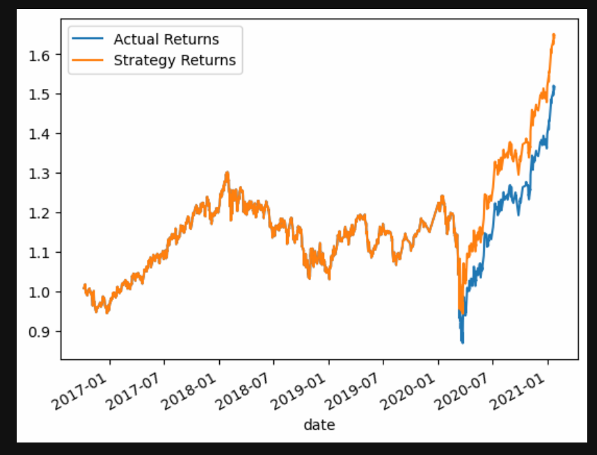

# Module 14 - Machine Learning Trading Bot

## Overview

The purpose of the module is to employ a machine learning bot with different parameters and tuning, in order to find the best possible outcomes (i.e. strategies) to deploy. Multiple methods, values, and training periods are tested in order to provide a relatively strong oversight of the possilbe parameters. After creating and running the new bots, the goal is to provide an optimal strategy to partake to ensure the highest possible returns.

### Baseline Model

The baseline model in this evaluation is the basical svm classifier output. This model is used as our controlled "variable", and will show our initial results.

### Classification Report for Baseline Model

        precision    recall  f1-score   support

        -1.0       0.45      0.48      0.47      1329
         1.0       0.57      0.53      0.55      1693

    accuracy                           0.51      3022
   macro avg       0.51      0.51      0.51      3022
weighted avg       0.51      0.51      0.51      3022

### Alternate (18months, Short Window=4, Long Window=100, Training Window Model)

The first alternate model that is tested shares all of the same parameters of the baseline model, except for one thing. Instead of having the Interval as 3 months, it is set to 18 months in this rendition. Comparative analysis on the classification report metrics, and also the difference in strategy returns.

### Alternate (3 months, Short Window=50, Long Window=250, SMA value Model)

The second alternate model that was tested was shared all of the same parameters as the baseline model as well, except that the Short and Long Window units were changed from( 4, 100 to -> 50, 250 respectively.

### Logistic Regression Model 

The logistic regression model is our way of bringing in an outisde method to our analysis to compare the results and to ensure we are using the most efficient model possible.

### Classification Report for Logistic Regression

              precision    recall  f1-score   support

        -1.0       0.45      0.52      0.48      1329
         1.0       0.57      0.50      0.53      1693

    accuracy                           0.51      3022
   macro avg       0.51      0.51      0.51      3022
weighted avg       0.52      0.51      0.51      3022

### Logistic Regression Model 

The Logistic Regression Model displays a mediocre accuracy score, posting a score of 0.51. When Comparing the Classes (i.e. -1, 1) the report shows us that the precision, and f1-score of the Class (-1) is lower than the performance than the respective class (1). The only indicator that the (-1) Class outperforms it's counterpart is in the recall category, and it only performs 2% better, therefore the advantages are insignificant.

### Conclusion: Logistic Regression Model VS. Baseline Model:

When comparing the initial baseline model and our logistic regression model to eachother, the former stands out as being the most accurate model. Although the logistic regression method yielded overall higher results, it was not by a substantial amount. Neither the baseline model, nor the logistic regression model were "successful" when it comes to making accurate predictions. Both models' overall accuracy hovers around the 50% range, which is essentially the same as flipping a coin. Making the models not yet trained enough to deploy and yield positive results.

